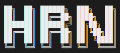

<div id="top"></div>

<div align="center">
  <a href="https://github.com/gabrielsiedler/house-rental-notifier">
    
  </a>

  <h3 align="center">House Rental Notifier</h3>

  <p align="center">
    I was tired of daily searching houses on multiple real estate websites.
    <br/>
    Instead, this does for me and sends me a WhatsApp when something new arrives.
  </p>
</div>

<!-- TABLE OF CONTENTS -->
<details>
  <summary>Table of Contents</summary>
  <ol>
    <li>
      <a href="#about-the-project">About The Project</a>
      <ul>
        <li><a href="#built-with">Built With</a></li>
      </ul>
    </li>
    <li>
      <a href="#getting-started">Getting Started</a>
      <ul>
        <li><a href="#prerequisites">Prerequisites</a></li>
        <li><a href="#installation">Installation</a></li>
      </ul>
    </li>
    <li><a href="#running">Running</a></li>
    <li><a href="#roadmap">Roadmap</a></li>
    <li><a href="#contributing">Contributing</a></li>
    <li><a href="#contact">Contact</a></li>
  </ol>
</details>

<!-- ABOUT THE PROJECT -->

## About The Project

[![House Rental Notifier][product-screenshot]]()

A crawler that looks for new entries on different real estate websites registered manually. And, once it founds it, it send a whatsapp message with a brief and a link.

The idea is to make it more generic and gather data for different subjects in the future.

<p align="right">(<a href="#top">back to top</a>)</p>

### Built With

The design made directly in the CLI, using native cursors from Node.js. Here are a few examples of frameworks/libraries used in this project.

- [Node.js](https://nodejs.org/)
- [MongoDB](https://www.mongodb.com/)
- [Chalk](https://github.com/chalk/chalk)
- [Puppeteer](https://github.com/puppeteer/puppeteer)
- [Typescript](https://www.typescriptlang.org/)
- [Twilio](https://www.twilio.com/)

<p align="right">(<a href="#top">back to top</a>)</p>

<!-- GETTING STARTED -->

## Getting Started

### Prerequisites

For this project you will need npm. Docker and yarn are optional.

- [nvm](https://github.com/nvm-sh/nvm#installing-and-updating)

- yarn

  ```sh
  npm install yarn@latest -g
  ```

- [docker](https://www.docker.com/)

### Installation

1. Clone the repo
   ```sh
   git clone https://github.com/gabrielsiedler/house-rental-notifier.git
   ```
1. Install NPM packages
   ```sh
   yarn
   ```
1. Edit the environment file in `.env`
   ```js
   TWILIO_ACCOUNT_SID=
   TWILIO_AUTH_TOKEN=
   TWILIO_TARGET_NUMBER=
   MONGODB_URI=
   ```

<p align="right">(<a href="#top">back to top</a>)</p>

<!-- USAGE EXAMPLES -->

## Running

```sh
  docker-compose up mongo
  yarn start
```

<p align="right">(<a href="#top">back to top</a>)</p>

<!-- ROADMAP -->

## Roadmap

- [x] Add sources selectors manually
- [x] Add Whatsapp messaging with Twilio
- [x] Add CLI design
- [ ] Make CLI responsive
- [ ] Make project generic
  - [ ] Move sources to a json structure
  - [ ] Change wording

See the [open issues](https://github.com/gabrielsiedler/house-rental-notifier/issues) for a full list of proposed features (and known issues).

<p align="right">(<a href="#top">back to top</a>)</p>

<!-- CONTRIBUTING -->

## Contributing

If you have a suggestion that would make this better, please fork the repo and create a pull request. You can also simply open an issue with the tag "enhancement".
Don't forget to give the project a star! Thanks again!

1. Fork the Project
2. Create your Feature Branch (`git checkout -b feature/AmazingFeature`)
3. Commit your Changes (`git commit -m 'Adds some AmazingFeature'`)
4. Push to the Branch (`git push origin feature/AmazingFeature`)
5. Open a Pull Request

<p align="right">(<a href="#top">back to top</a>)</p>

<!-- CONTACT -->

## Contact

Gabriel Siedler - [linkedin](https://www.linkedin.com/in/gabrielsiedler/) - gabrielsiedler@gmail.com

Project Link: [https://github.com/gabrielsiedler/house-rental-notifier](https://github.com/gabrielsiedler/house-rental-notifier)

<p align="right">(<a href="#top">back to top</a>)</p>

<!-- MARKDOWN LINKS & IMAGES -->
<!-- https://www.markdownguide.org/basic-syntax/#reference-style-links -->

[product-screenshot]: docs/running.gif
